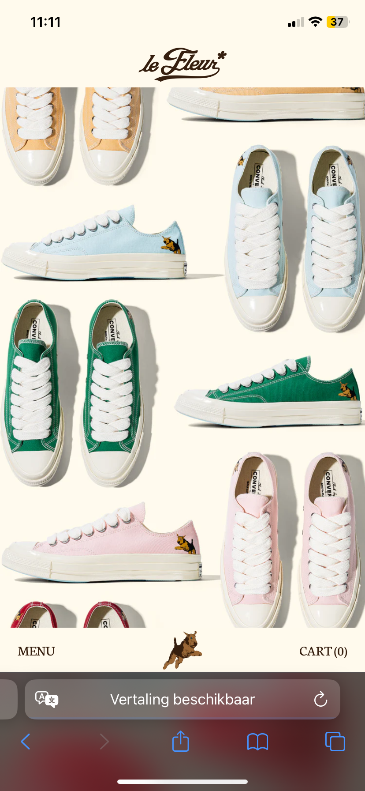
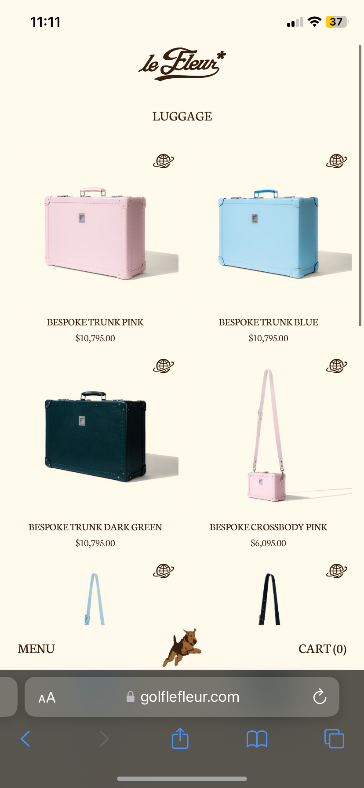

# Procesverslag
Markdown is een simpele manier om HTML te schrijven.  
Markdown cheat cheet: [Hulp bij het schrijven van Markdown](https://github.com/adam-p/markdown-here/wiki/Markdown-Cheatsheet).

Nb. De standaardstructuur en de spartaanse opmaak van de README.md zijn helemaal prima. Het gaat om de inhoud van je procesverslag. Besteedt de tijd voor pracht en praal aan je website.

Nb. Door *open* toe te voegen aan een *details* element kun je deze standaard open zetten. Fijn om dat steeds voor de relevante stuk(ken) te doen.

## Jij

  
uitwerken voor kick-off werkgroep

  ### Auteur:
  Rens Lous

  #### Je startniveau:
  Rood

  #### Je focus:
  Responsive
 

## Je website

  
uitwerken voor kick-off werkgroep

  ### Je opdracht:
  https://golflefleur.com/
  
  #### Screenshot(s) van de eerste pagina (small screen): 
  Homepage
  

  #### Screenshot(s) van de tweede pagina (small screen):
  Shop luggage  
  
 

## Toegankelijkheidstest 1/2 (week 1)

  
uitwerken na test in 2e werkgroep

  ### Bevindingen

  Verbeterpunten
  -Geen highlight om aan te geven waar je bent in de website.
  -Carousel onderaan pagina is niet te bedienen met arrow keys.
  -Veel elements met interactie maken dit niet toonbaar/hebben geen hover.
  -menu's kunnen niet sluiten met escape.

  Goed
  -navigatie verplaatst naar beneden in telefoon formaat
  -Op sommige pagina's, zoals product pagina van t-shirt met maar 1 afbeelding, wil je gaan scrollen maar kan dit bijvoorbeeld niet.

## Breakdownschets (week 1)

  
uitwerken na afloop 3e werkgroep

  ### de hele pagina: 
  

  ### dynamisch deel (bijv menu): 
  

  ### wellicht nog een dynamisch deel (bijv filter): 
  

## Voortgang 1 (week 2)

  
uitwerken voor 1e voortgang

  ### Stand van zaken
  hier dit ging goed & dit was lastig (neem ook screenshots op van delen van je website en code)
  Ik heb alle divs, sections en de header op de juiste plek, ik snap alleen niet hoe de knoppen vanaf de bovenkant van de site,
  responsive naar de onderkant kunnen gaan?

  ### Agenda voor meeting
  samen met je groepje opstellen

  | student 1      | student 2          | student 3    | student 4        |
  | ---            | ---                | ---          | ---              |
  | dit bespreken  | en dit             | en ik dit    | en dan ik dat    |
  | en dat ook nog | dit als er tijd is | nog een punt | dit wil ik zeker |
  | ...            | ...                | ...          | ...              |

  ### Verslag van meeting
  hier na afloop snel de uitkomsten van de meeting vastleggen

  - In plaats van een header en een footer, is de gehele header de onder en bovenkant van de pagina.
  - Door position fixed en @media te gebruiken, kan je doormiddel van top 0, en bottom 0 de buttons naar boven en beneden laten floepen.
  - Verder zag mijn website er goed uit, Thomas dacht al dat ik op de echte website zat. Sanne was minder onder de onderuk, het kwam alleen daar de plaatjes, dat kon hij ook.

## Voortgang 2 (week 3)

  
uitwerken voor 2e voortgang

  ### Stand van zaken
  Ik heb eindelijk de header werkend gekregen, en heb ervoor gezorgd dat alle delen van de website waar je mee kan interacteren dit nu aangeven, met een hover state. Ik ben blij met mijn menu, maar ben nu bezig met de navigatie (die verspringt vanuit de linkerkant en rechterkant van het scherm), en ik snap niet waarom mijn z-indexes niet werken.

  ### Agenda voor meeting
  samen met je groepje opstellen

  | student 1      | student 2          | student 3    | student 4        |
  | ---            | ---                | ---          | ---              |
  | dit bespreken  | en dit             | en ik dit    | en dan ik dat    |
  | en dat ook nog | dit als er tijd is | nog een punt | dit wil ik zeker |
  | ...            | ...                | ...          | ...              |

  ### Verslag van meeting
  hier na afloop snel de uitkomsten van de meeting vastleggen

  - Sanne heeft me laten zien hoe ik het allemaal kan oplossen met navigatie en met wat hulp van Thomas en Iris werken ze nu helemaal.
  - Ik moest nog veel divjes uit mijn code halen en vervangen met sections.
  - De hele indeling van mijn website veranderen zodat het semantisch allemaal klopt.

## Toegankelijkheidstest 2/2 (week 4)

  
uitwerken na test in 9e werkgroep

  ### Bevindingen
  - Alle interacteerbare elements hebben nu een hover state en geven dus aan dat je ermee kan interacteren.
  - Menu's kunnen nu sluiten met escape.

## Voortgang 3 (week 4)

  
uitwerken voor 3e voortgang

  ### Stand van zaken
  Ik moet voor de main page nog een carousel ontwerpen en kom er niet uit hoe ik deze kan laten werken. Ik wil scrollen combineren met knoppen zodat je er op meerdere manieren doorheen kan.

  ### Agenda voor meeting
  samen met je groepje opstellen

  | student 1      | student 2          | student 3    | student 4        |
  | ---            | ---                | ---          | ---              |
  | dit bespreken  | en dit             | en ik dit    | en dan ik dat    |
  | en dat ook nog | dit als er tijd is | nog een punt | dit wil ik zeker |
  | ...            | ...                | ...          | ...              |

  ### Verslag van meeting
  hier na afloop snel de uitkomsten van de meeting vastleggen

  - Door inline-block en overflow: scroll kan ik ervoor zorgen dat de carousel scrollbaar is.
  - Dmv van javascript heeft sanne me laten zien hoe ik ervoor kan zorgen dat de carousel ook met knoppen bedienbaar is.
  - Website ziet er verder goed uit en navigatie werkt goed en is responsive!

## Eindgesprek (week 5)

  
uitwerken voor eindgesprek

  ### Je uitkomst - karakteristiek screenshots:
  

  ### Dit ging goed/Heb ik geleerd: 
  Ik was uiteindelijk echt lekker bezig met programmeren en merkte bij de tweede pagina dat ik al echt veel geleerd had, omdat dit veel sneller ging. De indeling en vormgeving van de website ging elke snel en goed, dit lukt mij al goed. CSS gaat dus goed.

  

  ### Dit was lastig/Is niet gelukt:
  Met Javascript heb ik vaak nog problemen, ik ga vaak naar ChatGPT om me te helpen met mijn code, veel dingen lukken al wel zelf alleen ik heb vaak minder geduld om te gaan debuggen met ingewikkelde elementen.

  

## Bronnenlijst

  
continu bijhouden terwijl je werkt

  Nb. Wees specifiek ('css-tricks' als bron is bijv. niet specifiek genoeg). 
  Nb. ChatGpT en andere AI horen er ook bij.
  Nb. Vermeld de bronnen ook in je code.

  1. [bron 1](https://stackoverflow.com/questions/10671174/changing-button-text-onclick)
  2. [bron 2](https://stackoverflow.com/questions/3369593/how-to-detect-escape-key-press)
  3. [bron 3](https://chatgpt.com/c/67578522-1cec-800e-9dfe-47ccf2d074f7)

